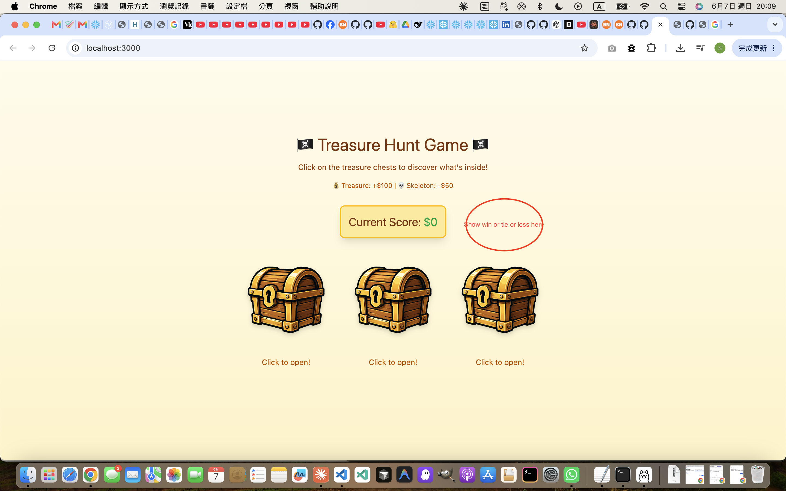
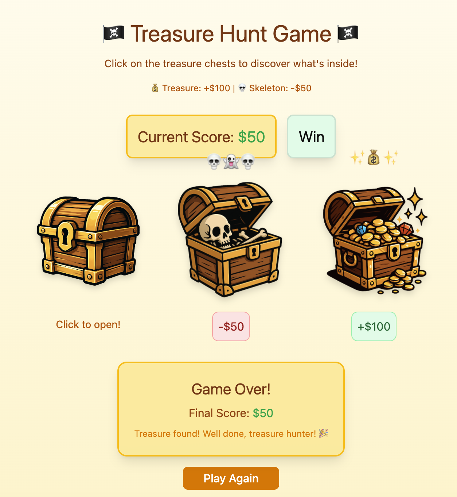
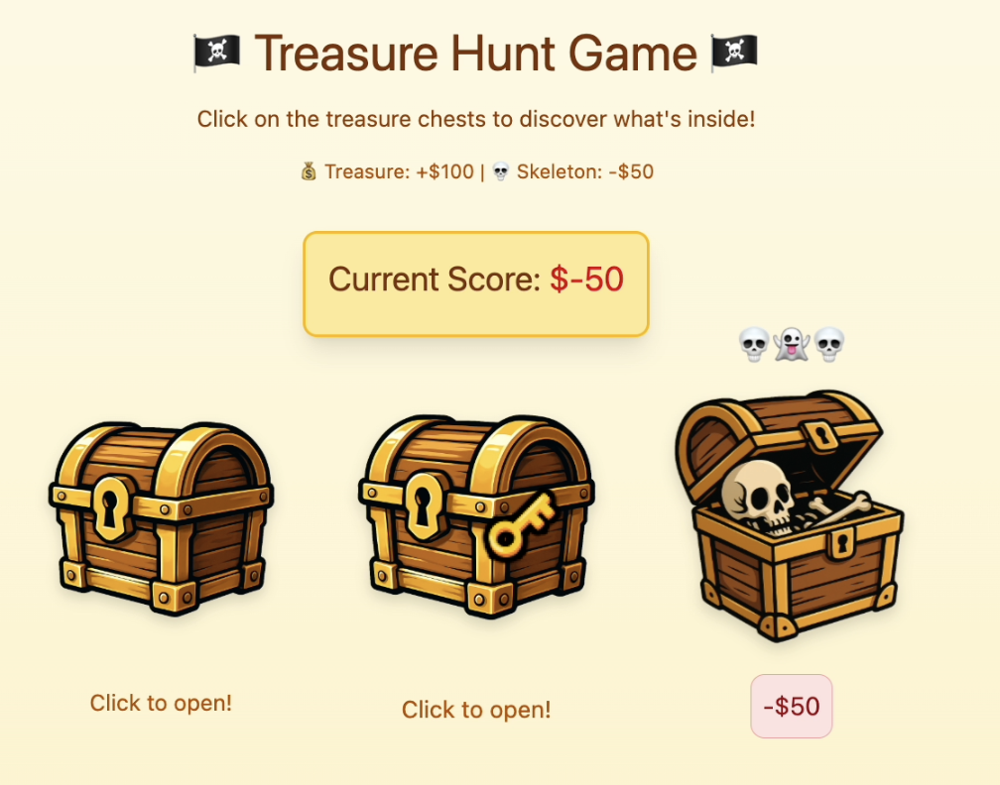

# Use Claude Code to Explore and Develop the project 
### Download the zip file of branch 'initial'
https://github.com/uopsdod/claude_code_treasure_game/tree/initial

### initialize the context
/clear
/init: generate the CLAUDE.md to understand how this project works 

npm install
npm run dev'

### specify file to the current context 
> use @src/audios/chest_open.mp3 in the @src/App.tsx to play the sound effect of the chest being opened. do not do anything else.

**Feature implemented:** chest open sound effect
- Prompt used: `use @src/audios/chest_open.mp3 in the @src/App.tsx to play the sound effect of the chest being opened. do not do anything else.`
- `src/audios/chest_open.mp3` plays via `new Audio(chestOpenSound).play()` inside `openBox()` in `src/App.tsx` whenever any chest is clicked open.

### add more to the context
> check the comments of existing changes

type '#' first 
"Always add comments on the top of every new function in one line to summarize the usage and Must document the inputs and output parameters" 
> 2. Project memory

> use @src/audios/chest_open_with_evil_laugh.mp3 in the @src/App.tsx when skeleton in the chest being opened. do not do anything else.

**Feature implemented:** skeleton chest evil laugh sound effect
- Prompt used: `use @src/audios/chest_open_with_evil_laugh.mp3 in the @src/App.tsx when skeleton in the chest being opened. do not do anything else.`
- `src/audios/chest_open_with_evil_laugh.mp3` plays instead of the regular sound when a skeleton chest is opened. Logic in `openBox()` in `src/App.tsx`: `new Audio(box.hasTreasure ? chestOpenSound : evilLaughSound).play()`

> check the comments of existing changes

### use screenshot to develop intuitively 
> screenshot and mark the area you want the change to be. 
> [!image] show the results to be either: win, tie, loss in the circled place according to the final score

**Feature implemented:** Win/Tie/Loss result badge next to the score
- Prompt used: `[screenshot] show the results to be either: win, tie, loss in the circled place according to the final score`
- A badge appears to the right of the Current Score box when the game ends. Score > 0 → Win (green), score = 0 → Tie (amber), score < 0 → Loss (red). Implemented in `src/App.tsx` alongside the score display.

### Challenge: change the hover mouse point icon
use the src/assets/key.png icon when the mouse hovers over the closed treasure box

**Feature implemented:** key cursor on closed chest hover
- Prompt used: `Change the cursor to @src/assets/key.png when cursor hover the chest. Change back to normal cursor when cursor is out of chest. do not do anything else.`
- Imported `key.png` and applied `cursor: url(keyIcon), pointer` inline style on each chest `motion.div`. Reverts to `cursor: default` when the chest is already open.

### manage context 
/context 
54k/200k tokens (27%)

> (optional) go through the url recursively to understand everything about SQLite and add all information in the context. 
https://nodejs.org/docs/latest/api/sqlite.html                                                      

/compact

/context 
> 26k/200k tokens (13%)

/clear 

/context
> 16k/200k tokens (8%)

> "Check my project with AngularJS to see if any syntax error."

esc + esc > select a conversation to go back 

### Plan mode: 
make a commit to store the current state

shift + tab 
> "What database options I have to implement sign up and sign in flow?"
> "how about SQLite as local storage?"
> "use SQLite to build a simple sign up and sign in flow and store the game score for each signed in user. In addition, allow to play the game as guest mode without storing any data."

> Ctrl + T: See the To-Do List 

### Ultrathink 
revert back to previous git commit 

> "Ultrathink to use SQLite to build a simple sign up and sign in flow and store the game score for each signed in user. In addition, allow to play the game as guest mode without storing any data."

**Feature implemented:** SQLite sign up / sign in + per-user score history + guest mode
- Prompt used: `ultrathink use SQLite to build a simple sign up and sign in flow and store the game score for each signed in user. In addition, allow to play the game as guest mode without storing any data.`
- `src/db.ts` — SQLite via `sql.js` (WASM). DB binary serialized to `localStorage` for persistence across reloads. Tables: `users (id, username UNIQUE, password_hash)`, `scores (id, user_id, score, result, played_at)`. Password hashing via `crypto.subtle.digest('SHA-256')`.
- `src/AuthScreen.tsx` — Sign In / Sign Up tabs + "Play as Guest" button. Each tab has its own `useForm` instance (required because Radix UI keeps both `TabsContent` panels in the DOM simultaneously).
- `src/App.tsx` — `AppMode` state machine (`loading → auth → game`). Signed-in users see score history after each game; guests see no history. Both guests and signed-in users see a top-bar with identity + Sign Out / Sign In button.
- `src/components/ui/input.tsx` — fixed to use `React.forwardRef` (required for `react-hook-form` to read field values).

> Ctrl + T: See the To-Do List 

### custom command - Vercel deployment
> ultrathink help me create my custom command in @.claude/commands/deploy_vercel.md i want to deploy my local project to vercel. Once done, give me the url to see my project on the internet.

**Feature implemented:** `/deploy_vercel` custom command + live Vercel deployment
- Prompt used: `ultrathink help me create my custom command in @.claude/commands/deploy_vervel.md i want to deploy my local project to vercel. Once done, give me the url to see my project on the internet.`
- Created `.claude/commands/deploy_vercel.md` — invoking `/deploy_vercel` in any future session runs the full deploy flow automatically (CLI check → auth check → vercel.json setup → `vercel --prod --yes` → returns live URL)
- Created `vercel.json` with `outputDirectory: build` (required since this project outputs to `build/` instead of Vite's default `dist/`)
- Installed Vercel CLI globally, authenticated, and deployed to production in one shot

**Live URL:** https://claudecodetreasuregame-***.vercel.app

### custom command - Github Page deployment
- create folder: .claude/commands
- create file: deploy_github_page.md 
- after creation, re-open a new claude code session